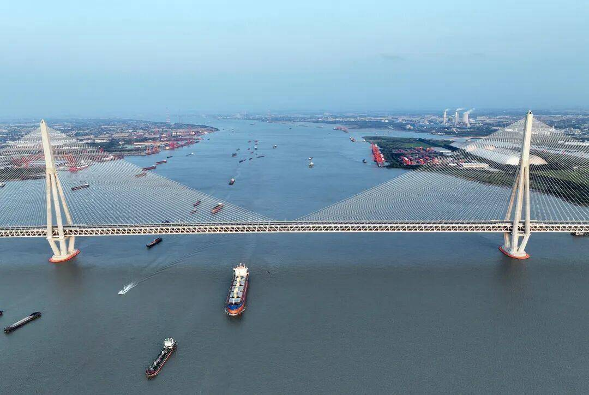

---

**Changtai Yangtze River Bridge Opens to Traffic, Setting 10 World Records**

The Changtai Yangtze River Bridge officially opened today after six years of construction, establishing itself as a new landmark in China’s transportation infrastructure. The mega project achieved **four world-first innovations** and set **six world records**, underscoring China’s global leadership in bridge engineering.

Spanning 10.03 kilometers across the Yangtze, the bridge links Changzhou and Taizhou. Travel time between the two cities is now reduced from 80 minutes to just 20 minutes.

The dual-use, double-deck design features a six-lane expressway on the upper deck, with a railway and a four-lane highway on the lower deck. It is the world’s largest multifunctional asymmetrical bridge, saving valuable river channel and land resources.

**World records include:**

* Longest cable-stayed span: 1,208 meters
* Longest-span road-rail steel truss arch: 388 meters
* Longest continuous steel truss girder: 4,620 meters
* Strongest parallel steel cables: 2,100 MPa
* Largest carbon-fiber composite cable: 599 meters
* First large-scale use of domestically developed epoxy resin deck materials

Advanced digital and intelligent technologies were deployed throughout construction, from underwater caisson excavation to digital twin systems for cable towers, setting a new benchmark for smart bridge building worldwide.

“This is a true world-class project,” said Xia Pengfei, Executive Deputy Commander at the Jiangsu Communications Construction Bureau. “The bridge demonstrates China’s comprehensive strength and innovation capability.”

With its strength, beauty, and groundbreaking engineering, the Changtai Yangtze River Bridge not only supports regional integration in the Yangtze River Delta, but also stands as a new symbol of China’s modernization drive.

---
- 

- Reference: [常泰长江大桥正式通车，实现4项“世界首创”6项“世界之最”](https://www.changzhou.gov.cn/ns_news/128175746480025)
