---

layout: post
title: "TVM and the Modern ML Inference Stack"
series: "Tech stack"
description: "TVM vs MLX, llama.cpp, ONNX Runtime, and TensorRT"
date: 2026-09-08 11:40:00 +0800
type: post
published: true
status: publish
categories: []
tags:

- TVM
- ML model
- LLM model
- Cross-hardware compliation
- llama.cpp
- ONNX
- TensorRT 
keywords: [TVM, ML, LLM, llama.cpp, ONNX, TensorRT]
permalink: /TVM-and-the-Modern-ML-Inference-Stack/

---

# TVM and the Modern ML Inference Stack

## TVM vs MLX, llama.cpp, ONNX Runtime, and TensorRT

Running modern AI models locally or in production often leads to a familiar list of technologies:

**MLX, llama.cpp, ONNX Runtime, TensorRT, TensorRT-LLM, and Apache TVM.**

It is tempting to treat them as competing inference frameworks. But that comparison is misleading.

The more useful question is:

> **Are you developing a model, executing a model, or compiling a model for a specific hardware target?**

That distinction explains where **Apache TVM** fits—and why it becomes particularly interesting for LLM optimization, edge AI, heterogeneous hardware, and custom accelerators.

---

## TL;DR

> **Apache TVM is primarily an ML compiler, not simply another LLM runtime.**
>
> TVM transforms high-level machine-learning computation into optimized implementations for target hardware through graph optimization, operator fusion, scheduling, kernel generation, and code generation.
>
> In contrast:
>
> * **MLX** — ML framework optimized for Apple Silicon.
> * **llama.cpp** — practical, portable engine for local LLM inference.
> * **ONNX Runtime** — portable runtime for executing ONNX models.
> * **TensorRT / TensorRT-LLM** — highly optimized inference stack for NVIDIA GPUs.
> * **TVM** — general ML compiler infrastructure for optimizing computation across CPUs, GPUs, NPUs, and specialized accelerators.
>
> For an **Apple M5 running Qwen3 or Qwen3-Omni**, the pragmatic starting point is usually **MLX → Metal → Apple Silicon**.
>
> TVM becomes interesting when profiling reveals a bottleneck that needs deeper compilation-level optimization, when custom kernels are required, or when the same ML workload must target diverse or specialized hardware.

The key takeaway:

> **Don't ask whether TVM is "better" than MLX or llama.cpp. Ask whether you need a compiler layer to control how your ML workload maps onto hardware.**

---

# 1. Where Does TVM Fit?

A simplified modern AI software stack looks like this:

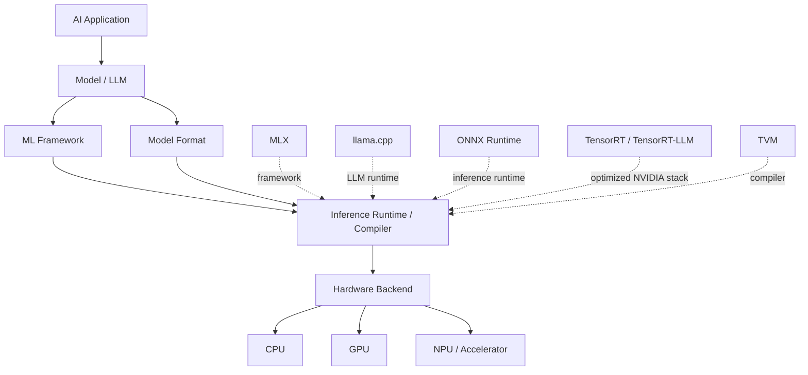

This diagram is intentionally simplified because these technologies overlap.

The important distinction is that they have **different centers of gravity**:

| Technology       | Primary role               | Main strength                           | Typical hardware focus |
| ---------------- | -------------------------- | --------------------------------------- | ---------------------- |
| **MLX**          | ML framework               | Apple Silicon development and execution | Apple Silicon          |
| **llama.cpp**    | LLM inference engine       | Local, quantized LLM inference          | CPU, Metal, CUDA, etc. |
| **ONNX Runtime** | Inference runtime          | Portable ONNX execution                 | Multi-platform         |
| **TensorRT**     | Inference compiler/runtime | NVIDIA optimization                     | NVIDIA GPUs            |
| **TensorRT-LLM** | LLM inference stack        | High-performance NVIDIA LLM serving     | NVIDIA GPUs            |
| **TVM**          | ML compiler                | Compilation and hardware optimization   | Multi-target           |

So the comparison is not really:

```text
TVM vs MLX vs llama.cpp vs ONNX Runtime
```

It is closer to:

```text
Frameworks
    │
    ├── MLX
    │
    └── PyTorch / JAX / ...

Inference runtimes
    │
    ├── llama.cpp
    └── ONNX Runtime

Hardware-optimized inference
    │
    └── TensorRT / TensorRT-LLM

ML compiler
    │
    └── Apache TVM
```

---

# 2. What Is Apache TVM?

[Apache TVM on GitHub](https://github.com/apache/tvm?utm_source=chatgpt.com) is an open-source machine-learning compiler stack.

Its fundamental objective is:

> **Take machine-learning computation and generate an efficient implementation for a target hardware platform.**

Conceptually:

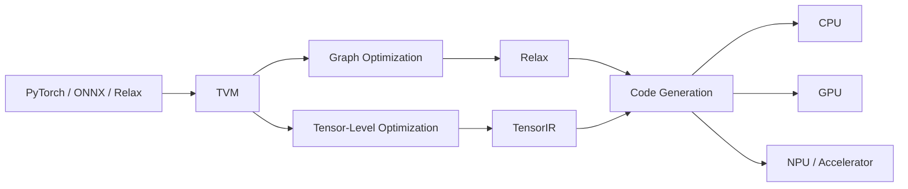

Modern TVM centers around two important levels of representation:

* **Relax** — higher-level representation for model and graph computation.
* **TensorIR** — lower-level representation for tensor programs and kernel optimization.

This multi-level architecture allows TVM to optimize ML workloads at different stages of compilation.

---

# 3. Why Do We Need an ML Compiler?

Consider matrix multiplication:

```text
C = A × B
```

Mathematically, the operation is straightforward.

Implementation is not.

The same operation can be implemented using:

```text
Naive implementation
        ↓
Tiled implementation
        ↓
Vectorized implementation
        ↓
Parallel implementation
        ↓
Hardware-specific implementation
```

These implementations produce the same result, but their performance can differ dramatically.

The optimal implementation depends on:

* CPU architecture
* GPU architecture
* cache hierarchy
* memory bandwidth
* SIMD width
* thread organization
* tensor cores
* accelerator instructions
* tensor shapes
* batch size
* numerical precision
* memory layout

This is the fundamental problem addressed by an ML compiler.

---

# 4. TensorIR: Controlling the Kernel

One of TVM's key components is **TensorIR**, which provides a representation for tensor computations that can be transformed and optimized.

Conceptually:

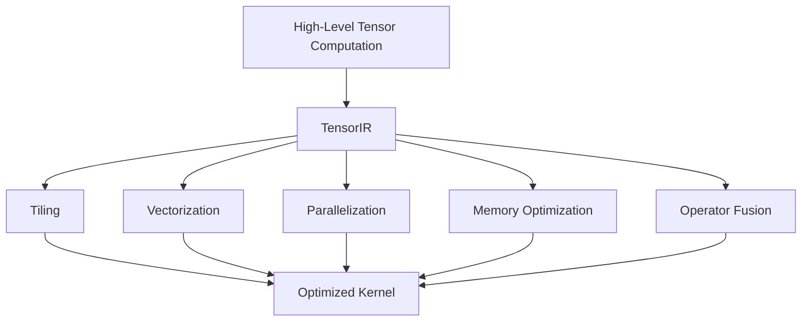

This gives compiler engineers fine-grained control over how computation maps onto hardware.

That is fundamentally different from simply calling a pre-existing inference operator.

---

# 5. Automatic Kernel Optimization

TVM also provides automated optimization mechanisms such as **MetaSchedule**.

Rather than manually testing every possible implementation, the compiler can explore different schedules and benchmark them on the target hardware.

Conceptually:

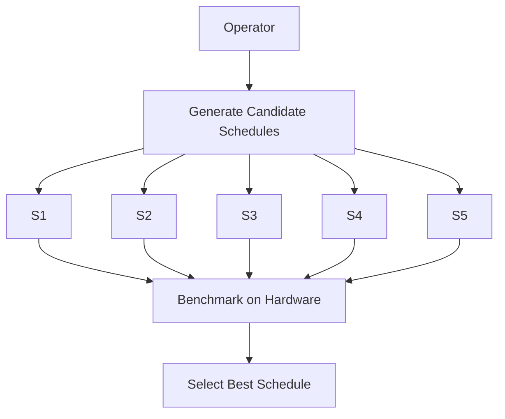

This matters because the optimal schedule is often **hardware- and workload-dependent**.

A schedule that performs well on one GPU may perform poorly on another.

---

# 6. Why This Matters for LLMs

Modern transformer models contain a collection of computational hotspots:

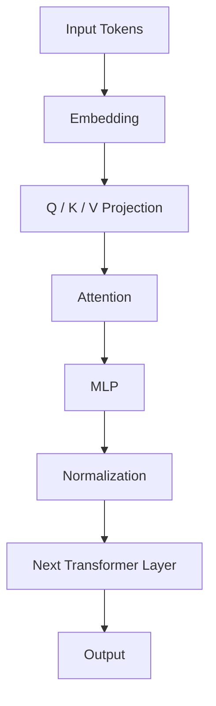

Underneath, these become operations such as:

* GEMM / GEMV
* attention
* reductions
* normalization
* elementwise operations
* quantization/dequantization
* KV-cache operations
* memory movement

Performance depends heavily on:

> **How these operations are mapped to the target hardware.**

This is precisely where compiler-level optimization becomes interesting.

---

# 7. Prefill vs Decode

LLM inference is also not one uniform workload.

There are two fundamentally different phases:

### Prefill

The model processes the input context.

```text
Long prompt
     │
     ▼
Transformer
     │
     ▼
Process many tokens
```

Prefill tends to involve relatively large matrix operations and can be strongly compute-bound.

### Decode

The model generates tokens sequentially:

```text
token → token → token → token → ...
```

Decode has a very different computational profile and can become heavily influenced by:

* memory bandwidth
* KV-cache access
* kernel launch overhead
* batch size
* model quantization

Therefore:

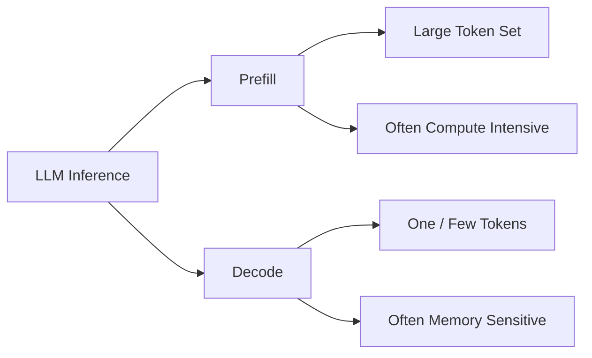

A compiler can potentially optimize these execution paths differently.

---

# 8. TVM vs MLX

This distinction becomes especially important on Apple Silicon.

**MLX** is a machine-learning framework designed specifically around Apple Silicon.

A simplified execution path is:

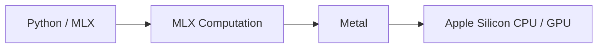

MLX is attractive because it is designed around Apple's unified-memory architecture and Metal GPU acceleration.

The conceptual distinction is:

### MLX

> **"I want to develop and run machine learning efficiently on Apple Silicon."**

### TVM

> **"I want to compile and optimize machine-learning computation for my target hardware."**

Therefore, they are better viewed as **complementary technologies** than direct substitutes.

---

# 9. TVM vs llama.cpp

[llama.cpp on GitHub](https://github.com/ggml-org/llama.cpp?utm_source=chatgpt.com) is primarily an LLM inference engine.

A typical architecture looks like:

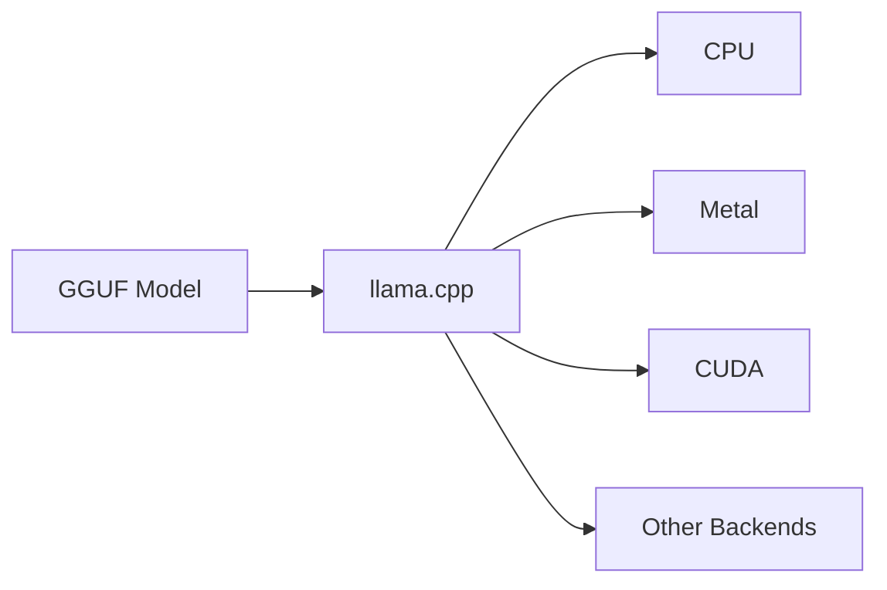

llama.cpp focuses on making local LLM inference practical and efficient.

Important capabilities include:

* quantized models
* GGUF
* KV cache
* token generation
* CPU inference
* GPU acceleration
* Metal
* CUDA
* batching
* sampling

So:

> **llama.cpp is primarily an LLM runtime/engine.**

TVM is primarily a compiler.

A useful mental model is:

```text
llama.cpp

LLM
 ↓
Inference engine
 ↓
Hardware


TVM

ML computation
 ↓
Compiler
 ↓
Optimized kernels
 ↓
Hardware
```

If the goal is simply:

> **"Run a quantized Qwen model locally."**

llama.cpp is usually a much more direct solution than building a TVM pipeline.

---

# 10. TVM vs ONNX Runtime

[ONNX Runtime](https://onnxruntime.ai/?utm_source=chatgpt.com) is a general-purpose inference runtime.

Its architecture is roughly:

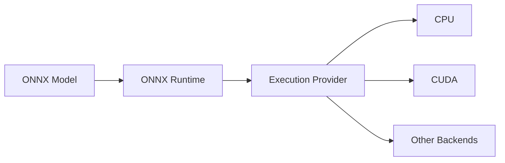

ONNX Runtime provides portability through **Execution Providers**.

This makes it attractive when:

* models are distributed as ONNX
* multiple hardware environments must be supported
* a standard inference API is desirable

TVM approaches the problem from a deeper compilation perspective:

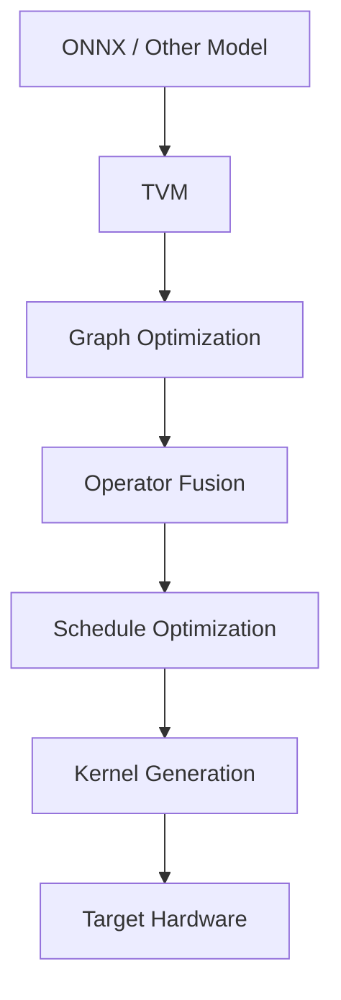

The distinction is therefore:

> **ONNX Runtime primarily provides a portable execution environment; TVM provides compiler infrastructure for transforming and optimizing ML computation.**

There is overlap, but the design center is different.

---

# 11. TVM vs TensorRT

[NVIDIA TensorRT](https://developer.nvidia.com/tensorrt?utm_source=chatgpt.com) is an inference optimization and runtime ecosystem focused on NVIDIA hardware.

A typical deployment path is:

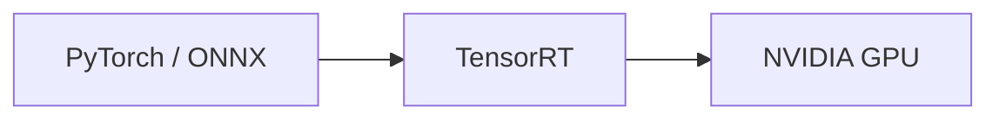

For LLMs, [NVIDIA TensorRT-LLM](https://github.com/NVIDIA/TensorRT-LLM?utm_source=chatgpt.com) extends this idea specifically for large language models.

TensorRT is particularly compelling for:

* NVIDIA GPUs
* production inference
* high throughput
* low latency
* optimized kernels
* large-scale LLM serving

The major difference is scope.

TensorRT is deeply optimized for the NVIDIA ecosystem.

TVM is designed as a broader compiler infrastructure:

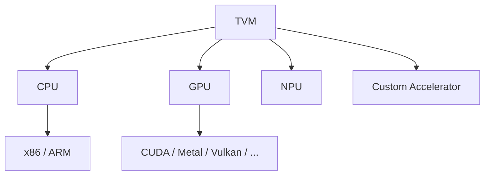

Therefore:

> **TensorRT is an excellent choice when NVIDIA is the target. TVM becomes particularly interesting when hardware diversity or compiler-level control matters.**

---

# 12. The Real Difference: Abstraction Level

A useful way to compare these technologies is by asking **how close they are to the hardware**.

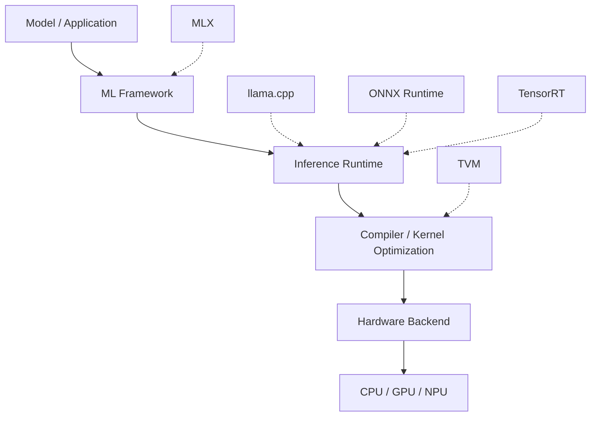

This is not a strict architectural hierarchy—some systems span multiple layers—but it provides a useful mental model.

The closer you get to the compiler layer, the more control you gain over:

* memory layout
* scheduling
* fusion
* vectorization
* parallelism
* kernel generation
* hardware-specific execution

The trade-off is increased engineering complexity.

---

# 13. TVM and Custom Hardware

This is where TVM becomes particularly strategically interesting.

Imagine a company developing a custom AI accelerator:

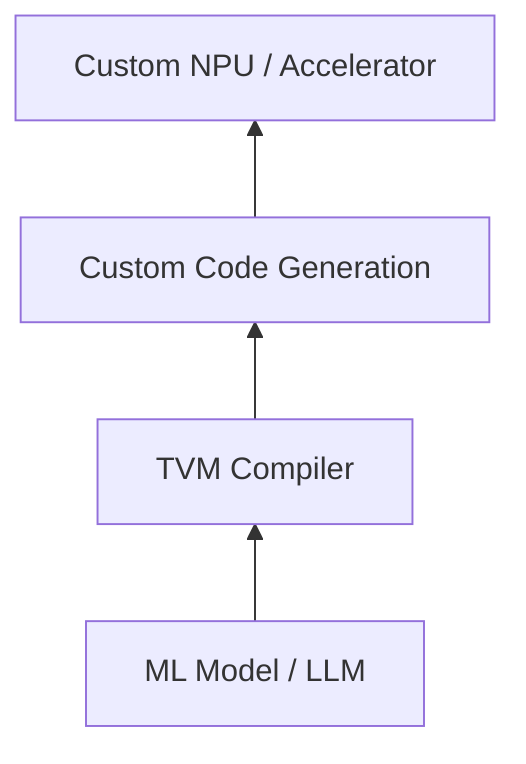

Instead of creating an entirely independent compiler stack for every ML framework, a hardware vendor can integrate its backend into an existing compiler ecosystem.

TVM's **Bring Your Own Codegen (BYOC)** architecture is particularly relevant here.

This makes compiler infrastructure useful for:

* NPUs
* AI accelerators
* edge devices
* embedded systems
* domain-specific hardware

The strategic value is not merely faster inference.

It is:

> **Reducing the distance between a model and an increasingly heterogeneous hardware ecosystem.**

---

# 14. TVM on Apple Silicon

Now consider an Apple M5.

Conceptually:


TVM supports Metal as a target.

But this does **not** mean TVM is automatically the best way to run every model on a Mac.

Apple's ML ecosystem already provides highly optimized primitives and hardware integration.

For many workloads, the more natural path is:

```text
Qwen3
  ↓
MLX
  ↓
Metal
  ↓
M5
```

The question is therefore not:

> **"Can TVM run on Apple Silicon?"**

It can.

The more useful question is:

> **"Does TVM provide a measurable advantage for my particular workload?"**

---

# 15. Qwen3 on Apple M5

For a text-only model such as Qwen3, a practical starting architecture is:

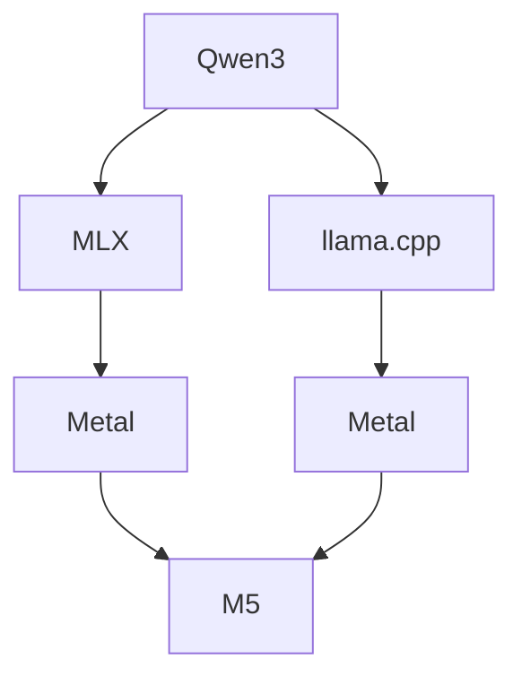

The choice depends on the goal.

### Choose MLX when you want to:

* experiment with models in Python
* build ML applications directly on Apple Silicon
* leverage Apple's unified memory
* customize model computation
* integrate with the MLX ecosystem

### Choose llama.cpp when you want to:

* run quantized LLMs
* use GGUF models
* build a lightweight local inference service
* maximize portability
* use a mature LLM inference engine

---

# 16. Qwen3-Omni Changes the Problem

Qwen3-Omni makes the compiler question even more interesting because multimodal models introduce multiple computational pipelines.

Conceptually:

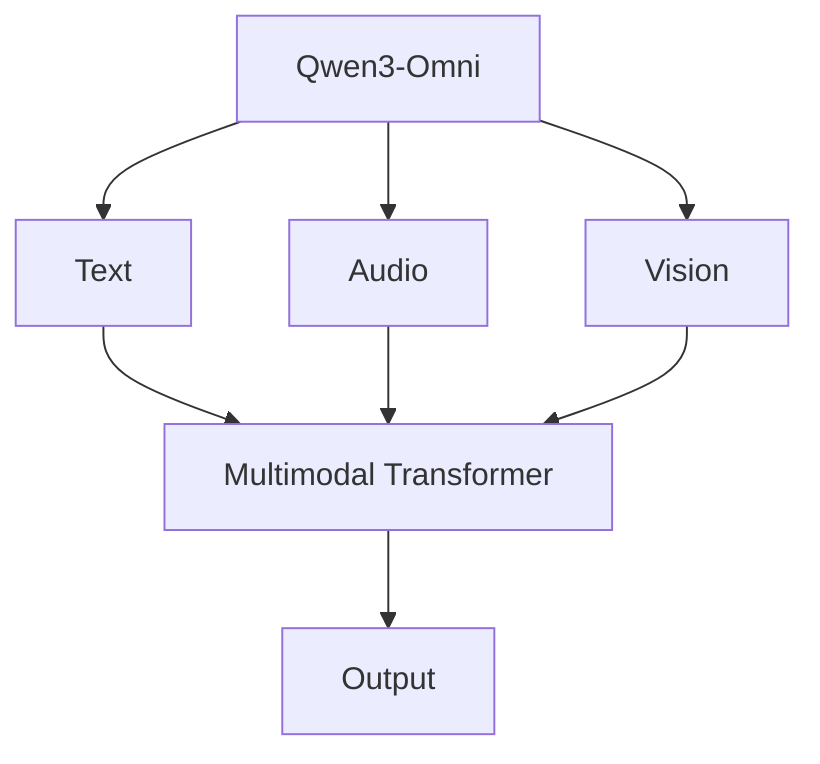

The system may involve:

* audio encoders
* vision encoders
* multimodal projections
* transformer layers
* text generation
* audio generation

The engineering question becomes:

> **Which components are already well optimized, and which components are the actual bottlenecks?**

That is a much more interesting compiler problem than simply asking whether a model "runs."

---

# 17. A Hybrid MLX + TVM Architecture

TVM does not necessarily need to replace the entire execution stack.

A potentially more practical architecture is:

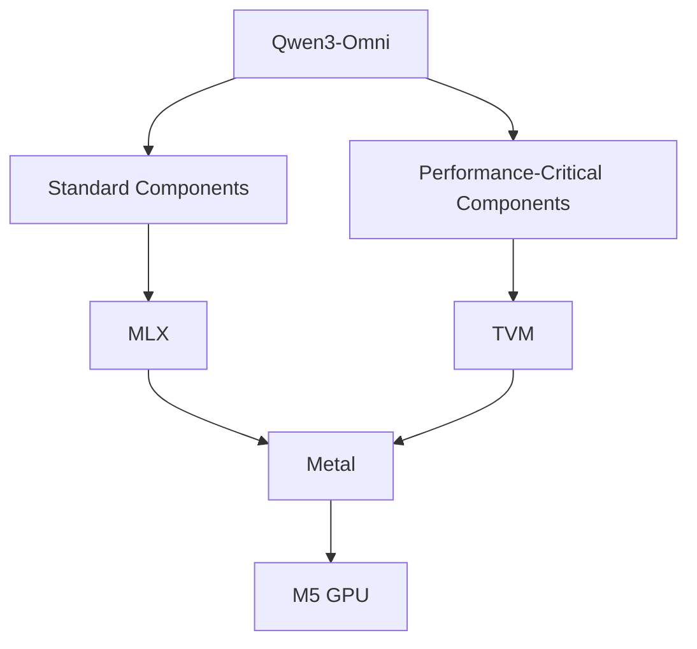

For example, suppose profiling produces:

```text
Audio encoder       15%
Vision encoder      20%
Projection           5%
Transformer         55%
Other                5%
```

The interesting question is not:

> "Can I compile everything with TVM?"

It is:

> **"Can I improve the component responsible for 55% of the runtime?"**

That is where compiler optimization can produce meaningful gains.

---

# 18. Profile First, Optimize Second

One of the most important lessons is:

> **Do not introduce TVM simply because it is a compiler.**

First establish a baseline.

For example:

```text
Qwen3
  ↓
MLX
  ↓
M5
```

Measure:

* model loading time
* memory consumption
* prefill tokens/sec
* decode tokens/sec
* context length
* KV-cache memory
* CPU utilization
* GPU utilization
* power consumption

Then identify the bottleneck.

Only after that should you ask:

```text
Can compiler-level optimization improve this bottleneck?
```

This avoids replacing a well-optimized runtime with a much more complex system without a measurable benefit.

---

# 19. A Practical Decision Tree

The simplest decision framework is:

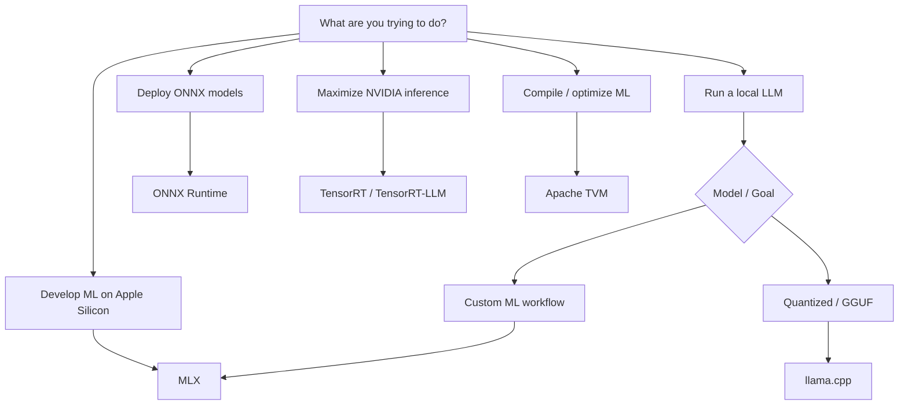

A concise rule of thumb:

| Requirement                                       | Strong starting point       |
| ------------------------------------------------- | --------------------------- |
| Develop ML on Apple Silicon                       | **MLX**                     |
| Run local quantized LLMs                          | **llama.cpp**               |
| Execute ONNX models                               | **ONNX Runtime**            |
| Maximize NVIDIA inference                         | **TensorRT / TensorRT-LLM** |
| Optimize ML computation across targets            | **TVM**                     |
| Build compiler infrastructure for custom hardware | **TVM**                     |

---

# 20. When Should You Use TVM?

TVM becomes particularly attractive when one or more of these conditions apply.

### 1. Performance is the primary concern

You need to squeeze additional performance from a specific workload.

### 2. Hardware is unusual

You have an NPU, accelerator, embedded processor, or specialized architecture.

### 3. You have multiple hardware targets

You don't want completely independent optimization stacks for every device.

### 4. You need custom kernels

Existing framework or runtime implementations are not optimal for your workload.

### 5. You are building an ML compiler

TVM provides substantial infrastructure for compiler research and development.

### 6. You want automated schedule optimization

MetaSchedule can explore different implementations and benchmark them against real hardware.

---

# 21. When Should You *Not* Use TVM?

If the requirement is simply:

> **"I want to run Qwen3 on my Mac."**

Start with:

```text
MLX
```

If the requirement is:

> **"I want to run quantized LLMs from GGUF."**

Start with:

```text
llama.cpp
```

If the requirement is:

> **"I need high-performance production LLM serving on NVIDIA GPUs."**

Look at:

```text
TensorRT-LLM
```

If the requirement is:

> **"I have ONNX models and need portable inference."**

Look at:

```text
ONNX Runtime
```

If the requirement is:

> **"I need to compile and optimize ML computation for different or custom hardware."**

Then:

```text
TVM
```

becomes compelling.

---

# 22. The Bigger Picture: From Runtime to Compiler

The AI software stack is increasingly separating into multiple layers:

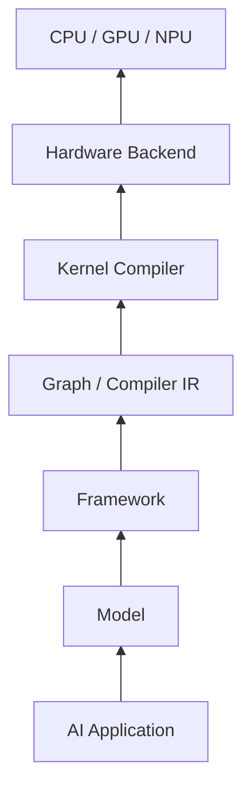

Historically, the dominant abstraction was often:

```text
Model
  ↓
Framework
  ↓
GPU
```

Modern AI systems increasingly look more like:

```text
                    Model
                      │
                      ▼
                  Framework
                      │
                      ▼
                Graph Compiler
                      │
                      ▼
                Kernel Compiler
                      │
          ┌───────────┼───────────┐
          ▼           ▼           ▼
         CPU         GPU         NPU
```

Why?

Because AI hardware is becoming increasingly heterogeneous.

We now have:

* CPUs
* GPUs
* NPUs
* AI accelerators
* edge processors
* cloud accelerators
* domain-specific hardware

A compiler layer can provide a common abstraction between the model and this increasingly diverse hardware landscape.

---

# 23. The Most Important Mental Model

The easiest way to remember the ecosystem is to ask:

### **What layer am I trying to optimize?**

```text
┌───────────────────────────────────────┐
│             AI Application            │
└───────────────────┬───────────────────┘
                    │
                    ▼
┌───────────────────────────────────────┐
│               Model                   │
└───────────────────┬───────────────────┘
                    │
                    ▼
┌───────────────────────────────────────┐
│            ML Framework               │
│                 MLX                   │
└───────────────────┬───────────────────┘
                    │
                    ▼
┌───────────────────────────────────────┐
│          Inference Runtime            │
│   llama.cpp / ONNX Runtime / etc.     │
└───────────────────┬───────────────────┘
                    │
                    ▼
┌───────────────────────────────────────┐
│          Compiler / Codegen           │
│                 TVM                   │
└───────────────────┬───────────────────┘
                    │
                    ▼
┌───────────────────────────────────────┐
│               Hardware                │
│          CPU / GPU / NPU              │
└───────────────────────────────────────┘
```

Again, real-world implementations can span multiple layers. The diagram is a mental model rather than a strict taxonomy.

---

# 24. Final Takeaway

The technologies discussed here are not simply interchangeable inference engines.

They solve different problems.

**MLX** is a natural choice for machine-learning development and execution on Apple Silicon.

**llama.cpp** is an excellent practical engine for local, quantized LLM inference.

**ONNX Runtime** provides portable execution for ONNX models.

**TensorRT and TensorRT-LLM** provide highly optimized inference for NVIDIA hardware.

**Apache TVM** operates at a deeper compiler layer, transforming and optimizing ML computation for target hardware.

For an Apple M5 developer interested in Qwen3 or Qwen3-Omni, a pragmatic workflow is:

```mermaid
flowchart TD
    A[Qwen3 / Qwen3-Omni]
        --> B[Start with MLX]

    B --> C[Run on Metal / M5]
    C --> D[Profile]

    D --> E{Bottleneck identified?}

    E -->|No| F[Keep MLX]
    E -->|Yes| G{Compiler optimization useful?}

    G -->|No| H[Optimize application / model / runtime]
    G -->|Yes| I[Evaluate TVM]

    I --> J[Custom kernels / schedules]
    J --> K[Measure improvement]
```

The key insight is therefore not:

> **"TVM is better than MLX."**

It is:

> **"MLX helps you develop and run ML on Apple Silicon; TVM gives you compiler infrastructure for controlling and optimizing how ML computation is ultimately mapped onto hardware."**

That distinction is what makes TVM particularly interesting for:

**LLM optimization · edge AI · heterogeneous computing · NPUs · custom accelerators · compiler research**

---

## References

* [Apache TVM](https://tvm.apache.org/?utm_source=chatgpt.com) — Apache TVM project and documentation
* [Apache TVM GitHub](https://github.com/apache/tvm?utm_source=chatgpt.com) — Source code and development
* [MLX](https://github.com/ml-explore/mlx?utm_source=chatgpt.com) — Apple's ML framework for Apple Silicon
* [llama.cpp](https://github.com/ggml-org/llama.cpp?utm_source=chatgpt.com) — Local LLM inference engine
* [ONNX Runtime](https://onnxruntime.ai/?utm_source=chatgpt.com) — Cross-platform ML inference runtime
* [NVIDIA TensorRT](https://developer.nvidia.com/tensorrt?utm_source=chatgpt.com) — NVIDIA inference optimization platform
* [NVIDIA TensorRT-LLM](https://github.com/NVIDIA/TensorRT-LLM?utm_source=chatgpt.com) — NVIDIA LLM inference stack
