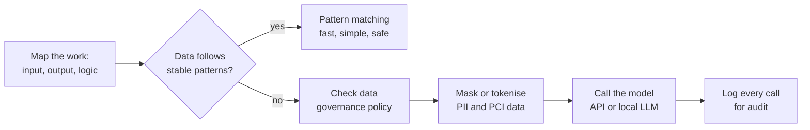

---

layout: post
title: "Enterprise Workflow Automation - Lessons from Practice"
date: 2026-10-06 23:40:00 +0800
type: post
published: true
status: publish
categories: [AI, Fintech]
tags: [workflow-automation, enterprise-ai, human-in-the-loop, data-governance, fintech, pattern-matching]
description: "A practical approach to enterprise workflow automation: decide whether you really need AI, handle PII and PCI data properly when you do, and follow an eight-step loop from pain point to release."
mermaid: true
comments: false

---

Good workflow automation removes friction from getting work done, and that rarely means replacing the human.

Some tasks can be fully automated, and then the solution is a plain scheduled job. Others need a person to make the final judgement. This human-in-the-loop pattern is the normal case, especially in fintech, where decisions about customers, funds and risk need an accountable human. This article shares the practical approach I use: how to decide whether AI is needed at all, what to check when it is, and the loop I follow from pain point to release.

## Do you really need AI?

Not always. I split workflow automation into two kinds: AI-free automation and AI-driven automation. Choosing between them starts with understanding the work, not the technology.

Sit with the business stakeholders and watch them do the job, or have them describe or demo it. Then turn each manual step into an algorithmic flow with a clear input, a clear output and explicit business logic.

- **Input.** Find out where the data comes from. Files that people download by hand may be available through an API instead. Check the formats too (CSV, Excel, sheets and so on), and expect to normalise them.
- **Output.** This is usually defined by the stakeholder or end user, so it must meet their requirement.
- **Process logic.** This is where you sometimes have a real choice: AI or no AI.

**Example: extracting fields from tickets and emails.** The first instinct is to use AI to pull out the user name, card number, transaction amount and client name. But that brings PII and PCI handling, plus a cost: either a paid API, or a local server running a named-entity model or a local LLM. After looking at the actual data, you may find that corporate tickets and emails follow stable patterns. Simple pattern matching then solves it, and it is faster, simpler and safer.

So analyse the data first, then decide. Always start from the simplest, cheapest and safest method, and add AI only when the data really needs it.

*Decision flow: if the data follows stable patterns, pattern matching is enough. If not, the AI path adds governance checks before the model call and audit logging after it.*

## When AI is a must

When the data really needs AI, check your data governance policy before any context or prompt goes into a model. Ask whether the data contains PCI data, PII or other sensitive information, and whether it needs to be masked, tokenised or anonymised first. Then log every call properly so there is an audit trail.

In a regulated business, these controls are part of the design from day one, not an add-on. Final decisions on customers, funds and cards stay with accountable people, and the specific policy requirements should be confirmed with Compliance and Risk before you build.

## The build loop

I follow the same eight steps for most automation projects.

1. **Hear the pain point.** A business stakeholder raises it, or you proactively talk with them until you understand it.
2. **Learn the current process.** Hold a group session to see the human process flow, the input data and the expected output.
3. **Draw the modules.** Turn the human flow into an abstract functional diagram. I sometimes sketch it by hand, then use Claude to polish and finalise it.
4. **Understand the input data.** Pin down its source, its format, and how to transform and normalise it.
5. **Align with stakeholders.** Share the diagram, discuss open questions, and confirm it.
6. **Design the architecture.** Once input, output, modules and their relations are settled, add the infrastructure, database and frameworks. Use Claude (chat or code) to draw the full architecture and write the technical design document, then review it with stakeholders. Be as detailed as you can for every part.
7. **Build with AI-assisted coding.** A typical system has a backend, a frontend, storage, audit logging, output and interactive logic. Tune the interaction flow to remove as much friction as you can.
8. **Test and release.** Use mock data where needed, write a concise cookbook that shows how to use the tool, then release to user testing.

## Design rule and takeaways

My main design rule is to keep the output in the same or a similar schema as before, so users pay almost no cost to adopt the new tool. The real change is behind the scenes: automation replaces multiple manual steps, the cross-platform data downloads and uploads, and the manual analysis.

- Start from the human process, not from the technology.
- Choose the simplest, cheapest and safest method first; add AI only when the data needs it.
- Treat data governance and audit logging as design inputs when AI is involved.
- Keep a human in the loop for final judgement, and make the interaction as frictionless as possible.


Mermaid note: the default GitHub Pages theme (minima) does not render Mermaid.
The `mermaid: true` flag above is for a layout that loads Mermaid, for example:





Without it, the diagram shows as a code block; the italic caption under it still carries the meaning.

